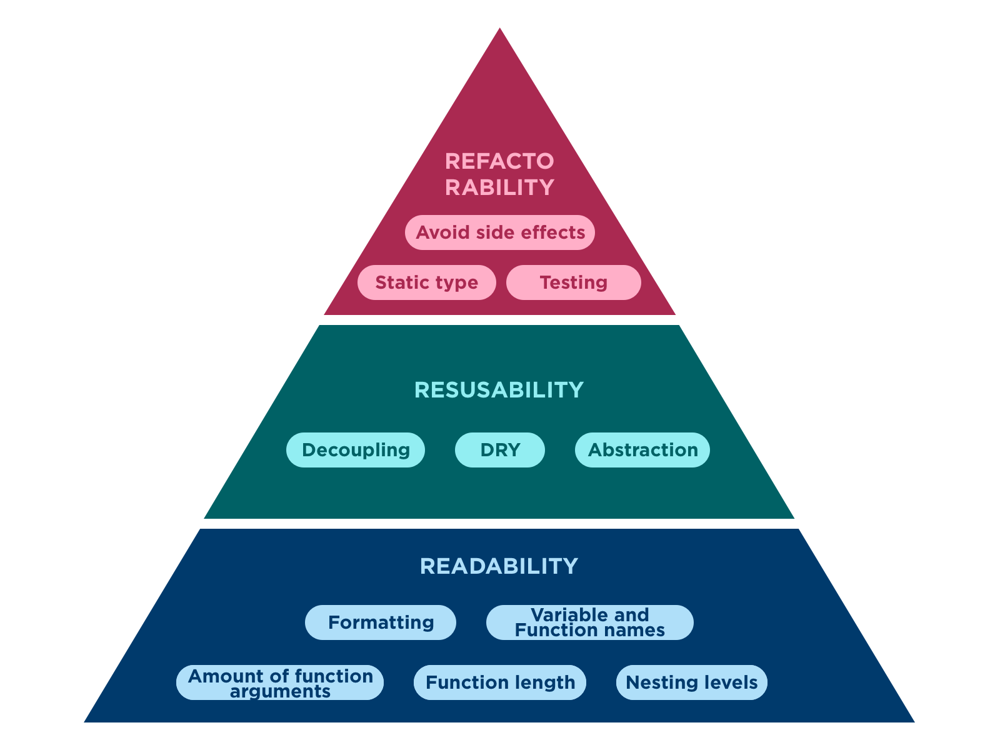

Original authors: [Ryan McDermott](https://github.com/ryanmcdermott) and [Burak Sonmez](https://github.com/bsonmez). See forked project for the original unedited text and the licence for more info.

# Java Code Pyramid

## Introduction
### Software Architecture
After 50+ years of software engineering's existence, we haven't settled on an exact definition of software architecture. After all, it is the art in computer science -- persistently evading our most determined efforts to define it. Even still, it's so vital to the fabric of our industry and applications that it's impossible to ignore.
Despite our lack of agreement, many definitions can help bring us closer to a formalization of software architecture. Perhaps the most notable of such comes from the IEEE:

*"Architecture is the fundamental organization of a system embodied in its components, their relationships to each other, the environment, and the principles guiding its design and evolution." [IEEE 1471]*

While this definition and others can bring clarity to the elements that make up architecture, it doesn't give us a mental model to use when developing our applications. This project, however, aims to provide just that. By looking at three particular "ilities": Readability, Reusability, and Refactorability, we can form a hierarchy of architectural attributes that can give us a framework for thinking about our system's code and architecture. It won't give you an architecture per se, for example, choosing between a design pattern or another. However, it will guide you in thinking about what architecture works for your application.

### What is this project?
This project is a guide that attempts to analyze 3 "ilities" of software architecture: Readability, Reusability, and Refactorability. It will show how we can form better code by thinking through these concepts hierarchically. This project is for any developer of any skill level, but if you are starting, you will find more value in this than a seasoned practitioner.

The code we will look at is a shopping cart application written in Java. We will develop our application one piece at a time and look at Bad vs. Good versions at each step in the 3 R hierarchy. You can find the code in the `src` directory. The instructions for developing this application are at the bottom of this README.

One more thing to reiterate: this project isn't the only way to look at software, and it certainly can't give you an architecture, but it's something that can hopefully guide your thinking, as it has guided me.

Without further ado, let's get started!

---
## 1. Readability
### About
Readability is the simplest way of assessing code quality and is the most straightforward fix. It is the most obvious thing you see right when you open up a piece of code, and it generally consists of:
1. Formatting
2. Variable and Function names
3. Amount of function arguments
4. Function length (number of lines)
5. Nesting levels

These aren't the only things to consider but are immediate red flags. Fortunately, there are a few easy rules to follow to fix problems associated with those above:

1. **Formatting:** Invest in an automatic formatter. Find one your team agrees on and integrate it into your build process. Nothing wastes more time and money during code reviews than formatting arguments. To format your code in Intelli-J idea on macOS press `cmd` + `option` + `L`. On Windows press `Ctrl` + `Alt` + `L`.
2. **Variable and Function names:** Use meaningful and pronounceable variable and function names. Code is for people and only incidentally for computers. Naming is the biggest thing that communicates the meaning behind your code.
3. **Amount of function arguments:** Limit your function arguments between 1-3. Having 0 arguments implies you're mutating or relying on a state coming from somewhere other than your caller. More than 3 arguments are just plain hard to read. Refactoring becomes difficult because there are so many paths your function can take the more arguments it has, making unit testing even harder to implement.
4. **Function length:** The main point is that your function should only do ONE thing. If the function you created to calculate the price of an item after taxes first has to connect to the database, look up the item, get the tax data, and then do the calculation, it's doing more than one thing. Long functions typically indicate too much is happening.
5. **Nesting levels:** More than two levels of nesting can imply poor performance (in a loop), and it can be tough to read in long conditionals. Consider extracting nested logic into separate functions.

## In practice
Look at this first piece of our shopping cart application to see what bad readability looks.

[Right-click and choose open in a new tab.](#)

There are several problems we can see right away:
1. Inconsistent and unpleasant formatting.
2. Poorly named variables.
3. Comments that are either unnecessary or serve the job of what a good variable name would.

Let's take a look at how we could improve it:

[Right-click and choose open in a new tab.](#)

This improved code now exhibits the following features:
1. It is consistently formatted using the default formatter inside the Intelli-J idea code editor.
2. Names are much more descriptive.
3. Comments are no longer needed because good naming clarifies the code's meaning. Comments are needed when business logic is complex and when documentation is required.

---

Part 2 and 3 of the pyramid are comming soon...